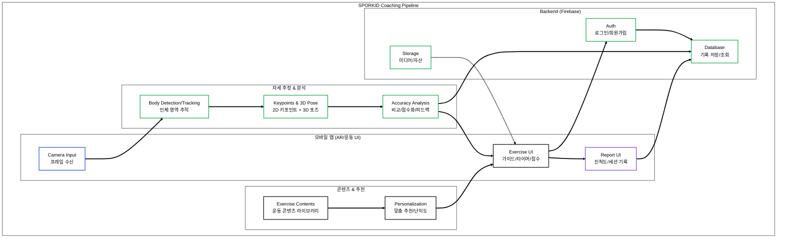

# 🧒 SPORKID (AR 자세 교정 기반 청소년 운동 코칭)

> **SPORKID는 아동·청소년을 대상으로 스마트기기 기반 AR 자세 교정 + 맞춤 운동 콘텐츠 + 운동 데이터 리포트**를 제공하는 **맞춤형 디지털 헬스케어 앱**입니다.  
> “운동 선택 → 카메라 기반 자세 인식 → 정확도 분석/피드백 → 기록 저장 → 리포트 확인” 흐름을 재현 가능한 구조로 구현했습니다.

 

## 📸 Project Showcase
<!-- 실제 스크린샷/데모가 있으면 아래에 이미지 링크를 넣어주세요 -->

 

## 📝 Introduction

아동·청소년 홈트 환경에서는 **“올바른 자세”를 스스로 판단하기 어렵고**, 단순 영상 시청 방식은 **피드백/기록/동기부여**가 약해 지속성이 떨어지기 쉽습니다.  
SPORKID는 스마트폰 카메라 기반 **자세 추정(키포인트/3D 포즈)** 결과를 이용해 **운동 정확도 분석과 실시간 가이드**를 제공하고, 운동 결과를 **리포트/기록**으로 축적해 **맞춤형 운동 경험**을 지원합니다.

### Key Features
- **카메라 기반 자세 인식**: 프레임 입력에서 2D 키포인트 및 3D 포즈 산출
- **운동 정확도 분석/점수화**: 기준 동작 대비 정확도 평가 및 피드백 생성
- **맞춤형 프로그램 제공**: 사용자 기록 기반 추천/난이도 조절
- **리포트/진척도**: 운동 결과 요약, 세션 기록, 성과 확인 UI
- **클라우드 연동**: 사용자 인증/기록 저장/조회 및 콘텐츠 자산 관리

 

## 🏗 System Architecture

 

## 🛠 Tech Stack

| Category | Technology | Description |
| --- | --- | --- |
| **Engine** | Unity 2019.4.8f1 | 모바일 앱/씬 구성/카메라 입력 및 UI 렌더링 |
| **Language** | C# | 자세 분석, 점수화, 데이터 저장/조회 로직 구현 |
| **Pose Estimation** | Keypoints / 3D Pose Pipeline | 카메라 프레임 → 인체 추적 → 2D 키포인트 + 3D 포즈 산출 |
| **Backend** | Firebase (Auth / Database / Storage) | 로그인/회원가입, 운동 기록 저장·조회, 콘텐츠/미디어 자산 관리 |
| **UI / Report** | Progress / Session Report UI | 점수/진척도/세션 기록 기반 리포트 및 피드백 표시 |
| **Platform** | Android (Mobile) | 실사용 환경(카메라 권한/성능 고려), 모바일 배포 타깃 |

 

## 📂 Implementation Details

### 1. Pose Estimation (Camera → Keypoints / 3D Pose)
- 스마트폰 카메라 프레임을 입력으로 받아 **인체 영역 추적**을 수행합니다.
- 추적 결과로부터 **2D 키포인트(관절) 및 3D 포즈 정보**를 산출하고, 운동 평가의 입력 데이터로 사용합니다.

### 2. Accuracy Analysis (Compare / Score / Feedback)
- 기준 동작(레퍼런스 포즈)과 사용자의 포즈를 비교해 **정확도 점수**를 계산합니다.
- 오차가 큰 관절/구간을 식별해 **즉시 피드백(교정 가이드)**로 UI에 반영합니다.

### 3. Personalized Program (Recommendation / Difficulty)
- 누적된 운동 기록(세션 결과/진척도)을 기반으로 **맞춤형 프로그램 추천** 또는 **난이도 조절**을 제공합니다.
- 사용자가 반복 수행 시 개선을 체감할 수 있도록 **단계형 콘텐츠 흐름**을 구성합니다.

### 4. Report & Logging (Progress / Session History)
- 운동 완료 후 결과를 **점수/진척도/세션 요약 리포트**로 제공하여 성과 확인을 돕습니다.
- 세션 단위 기록을 축적해 “최근 기록/누적 성과”를 지속적으로 조회할 수 있게 합니다.

### 5. Backend Integration (Auth / DB / Storage)
- Firebase Auth로 사용자 인증(로그인/회원가입)을 처리합니다.
- Database에 운동 기록을 저장하고, 사용자별 기록을 조회해 리포트 및 추천 입력으로 사용합니다.
- 필요 시 Storage를 통해 콘텐츠/미디어 자산을 관리합니다.

 

## 🧩 What I Built (기술 구현 요약)
- **카메라 기반 자세 인식 파이프라인**: 프레임 입력 → 키포인트/3D 포즈 산출 → 평가 입력화
- **정확도 분석/피드백 루프**: 동작 비교 → 점수화 → 실시간 교정 가이드 반영
- **데이터 기반 코칭 구조**: 세션 기록 저장/리포트 → 맞춤 추천으로 연결

 

## 🚀 How to Run

1. Unity로 프로젝트 열기  
- Unity 2019.4 LTS 권장(빌드 환경 기준)

2. 플랫폼 설정  
- Android Build Target 설정
- 카메라 권한/권한 설정 확인

3. 실행 흐름  
- 앱 실행 → 로그인(선택) → 운동 선택 → 자세 인식 → 점수/피드백 → 기록 저장 → 리포트 확인

 

## ⚠️ Notes
- 조명/거리/카메라 각도에 따라 자세 인식 품질이 달라질 수 있습니다.
- 키포인트 기반 평가는 기준 동작/허용 오차(Threshold) 설계가 결과에 큰 영향을 줍니다.
- 미성년자 대상 서비스 특성상 개인정보/동의/보관 정책 설계가 필수입니다.

 

## ⚖️ License

Copyright (c) Soongsil University. All Rights Reserved.

This project was developed as part of a curriculum or research at **Soongsil University**.  
Unauthorized commercial use or distribution is prohibited.
